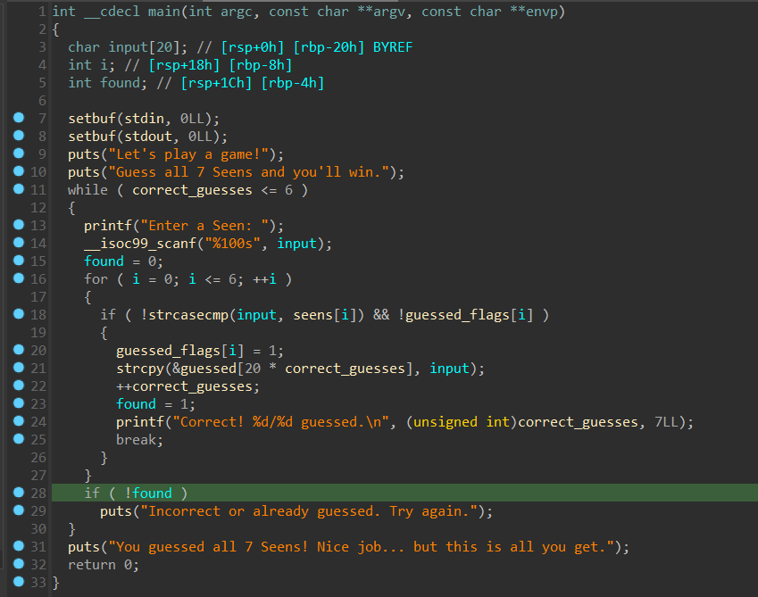
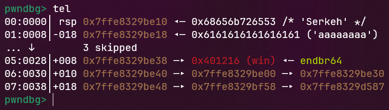
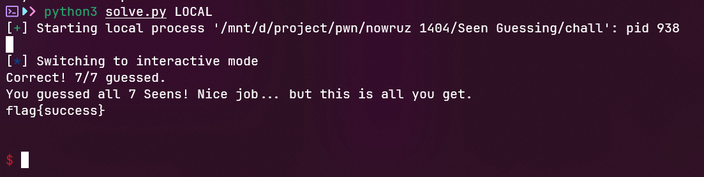

# Seen Guessing
## Chall
[chall](Seen_Guessing/chall)
## Exploit
- Đọc qua code ta thấy có hàm win đọc flag, nghĩ ngay đến kỹ thuật ret2win

- 6 lần đầu ta sẽ nhập dữ liệu như bình thường và đến lần nhập thứ 7 ta sẽ buffer overflow để chiếm được hàm win

