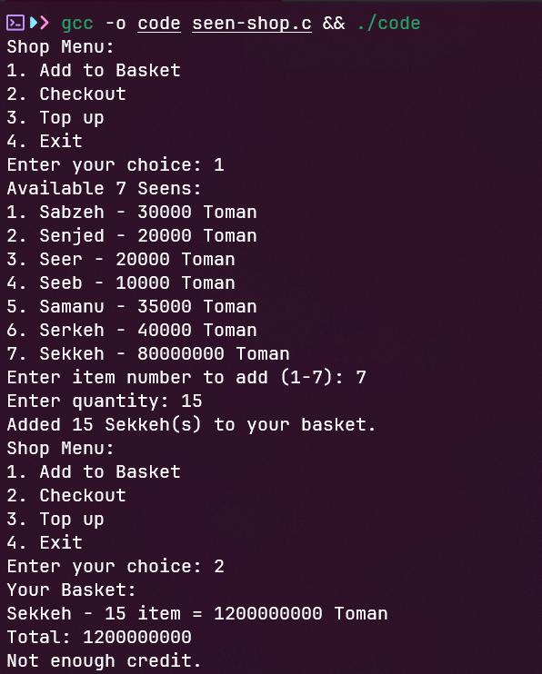

# Seen Shop
## Chall
[chall](code)
## Exploit
- Đọc qua source code, ta thấy:

- Nếu ta nhập như bình thường thì sẽ ko thể đọc được flag, do đó ta sẽ sử dụng kĩ thuật Integer Overflow để total < 0

