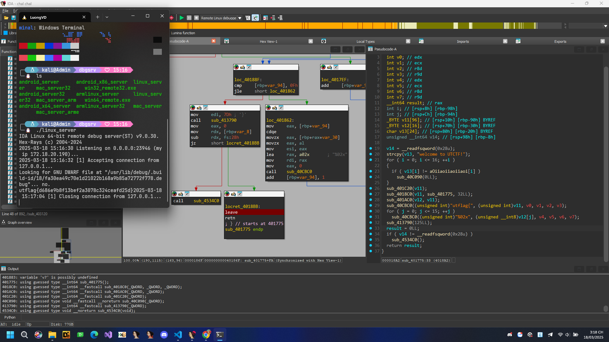
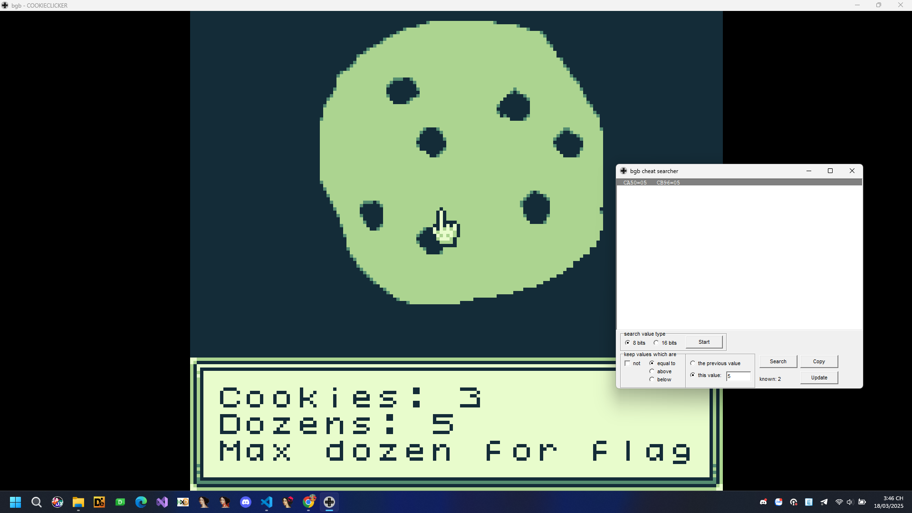
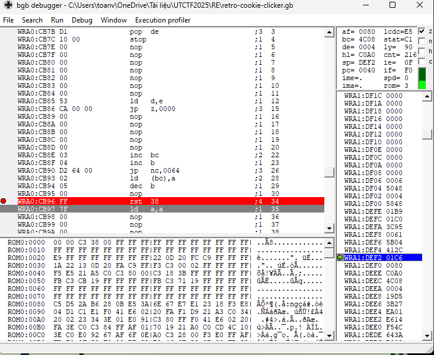
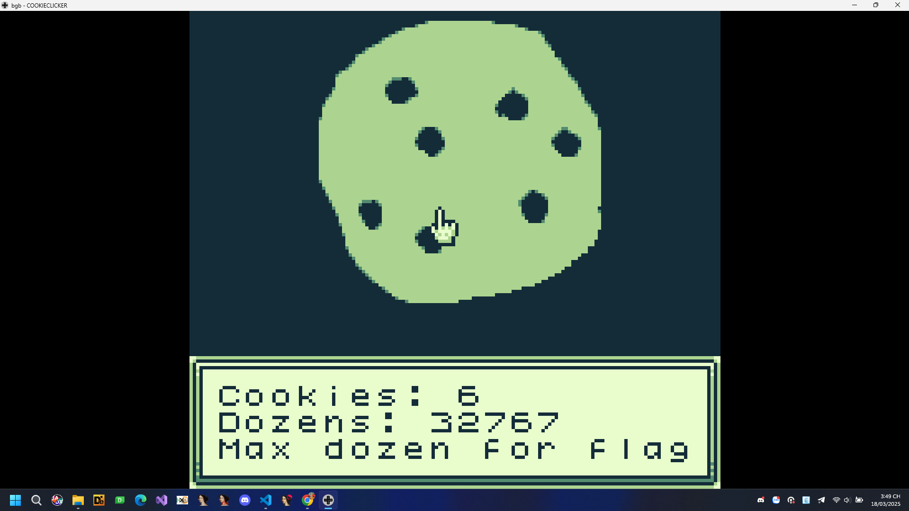
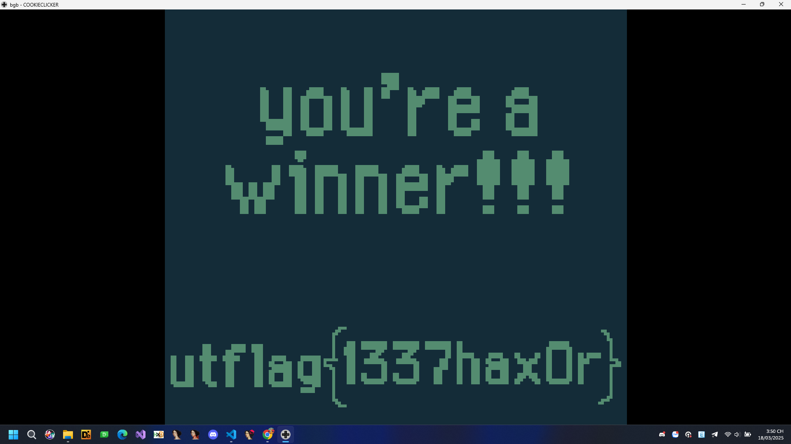

## Ostrich Algorithm

Khá đơn giản chúng ta chỉ cần patch hoặc chỉnh cờ để đi được đến cuối chương trình và nhận được flag

  
Click để nhìn flag mỗi file có thể có 1 file khác nhau

  utflag{d686e9b8f13bef2a3078c324ceafd25d}

## Retro Cookie Clicker

Chúng ta nhận được 1 file gb. Sau 1 lúc tìm hiểu tôi đã mở được nó bằng tool bgb đây là 1 file game boy.

Qua một hồi tìm kiếm tôi đã tìm được offset lưu điểm mục đích của tôi là chỉnh tối đa điểm này và có được flag.

Tôi thử sửa thành 7FFF max range của short.

Sau đó ấn phím S một lần nữa chúng ta sẽ có được flag.

