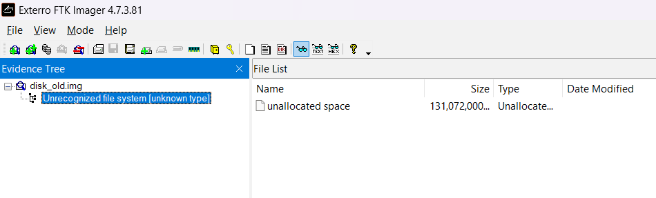
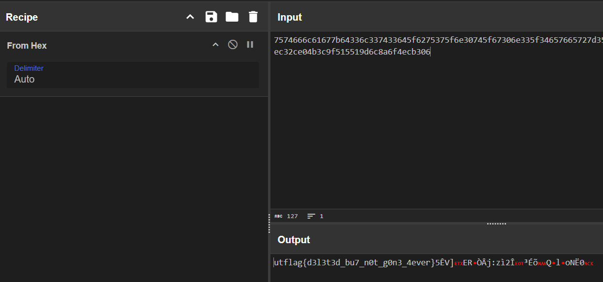

# Forgotten Footprints

I didn't want anyone to find the flag, so I hid it away. Unfortunately, I seem to have misplaced it.

https://drive.google.com/file/d/1L75zJ1ha1-myAM3vL_C6lpT8VJe1XQHB/view?usp=sharing

---

The challenge provied a `.img` file (Google Drive link above).

After some researches, I found an application that is `FTK Imager` which can read the `.img` file

However the app showed nothing - just unallocated space and I don't know what to do next

# Solution

Ok guys, I know this solution seem to be not unoffical solution because I saw a lot of suspicios file (eg. `b9e240c5fe535e10df685d9d90b73960.txt`) when I `strings disk.img`

There might be a way to open the file but sorry guys, I have no ided for how to read those types of files

Still in the `strings disk.img` ouput  
I saw a really suspicious hexa-string in the head of file

`7574666c61677b64336c337433645f6275375f6e30745f67306e335f34657665727d35ca565d03455294d2c26a3a7aec32ce04b3c9f515519d6c8a6f4ecb306....`

With CyberChef, I quickly decoded the hexa-string and got the flag

# Flag: `utflag{d3l3t3d_bu7_n0t_g0n3_4ever}`